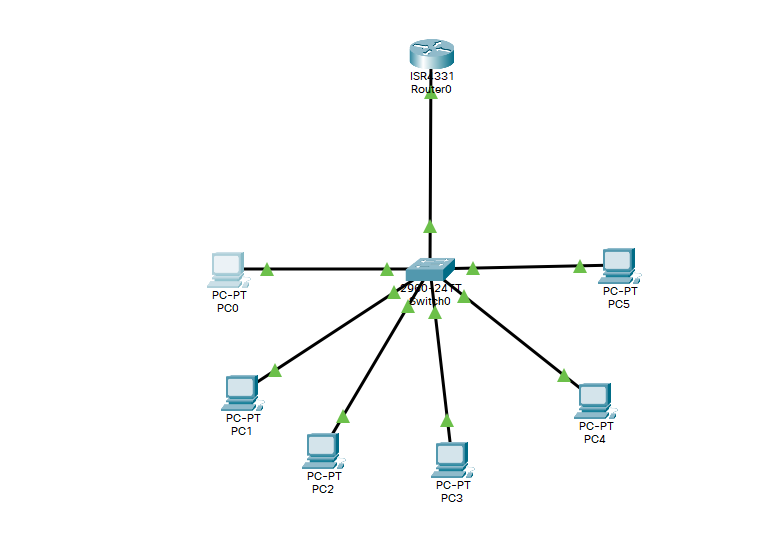

# Лабораторная работа № 10


## Информация о текущей топологии:

### Роутеры и коммутаторы:

| Имя сетевого устройства | IP адреса интерфейсов | Маска подсети | Что настроенно |
| ----------------------- | --------------------- | ------------- | -------------- |
| R0                      | 192.168.0.1 (G0/0/0)  | /24           | DHCP           |

### Компьютеры и сервера

| Имя устройства | IP адрес           | Маска подсети | Vlan |
| -------------- | ------------------ | ------------- | ---- |
| Switch0        | 192.168.0.2 (Vlan) | /24           | ---  |
| PC0            | Динамический       | /24           | 10    |
| PC1            | Динамический       | /24           | 10    |
| PC2            | Динамический       | /24           | 20    |
| PC3            | Динамический       | /24           | 20    |
| PC4            | Динамический       | /24           | 30    |
| PC5            | Динамический       | /24           | 30    |

## Задание:

Построить топологию на основе таблиц выше. На коммутаторе занести интерфейсы в соответвующий Vlan. Интерфейс от Switch0 до R0 настроить как транковый. На R0 настроить DHCP сервер. Ответить на вопросы ниже:

1. В чем отличие теггированного от нетеггированного трафика?
Теггировынный трафик обращает внимание на тегги в отличии от нетеггированного трафика.

2. Может ли при настроенной топологии PC0 получить сетевой доступ к PC3?
Нет не может, так как PC3 находиться в другом vlan и покеты просто будут отбрасоваться.

## Решение
1) Настройка DHCP:
```
ip dhcp pool default
network 192.168.0.0 255.255.255.0
ip dhcp excluded-address 192.168.0.1
```
2) Создание vlan:
```
vlan 10 - 20 - 30
name vlan10,vlan20,vlan30
```
3) Настройка vlan:
```
int fa0/1
switchport mode access
switchport access vlan 10
```
4) Настройка транка:
```
int g0/1
switchport mode trunk
switchport trunk allowed vlan 10,20,30
```
