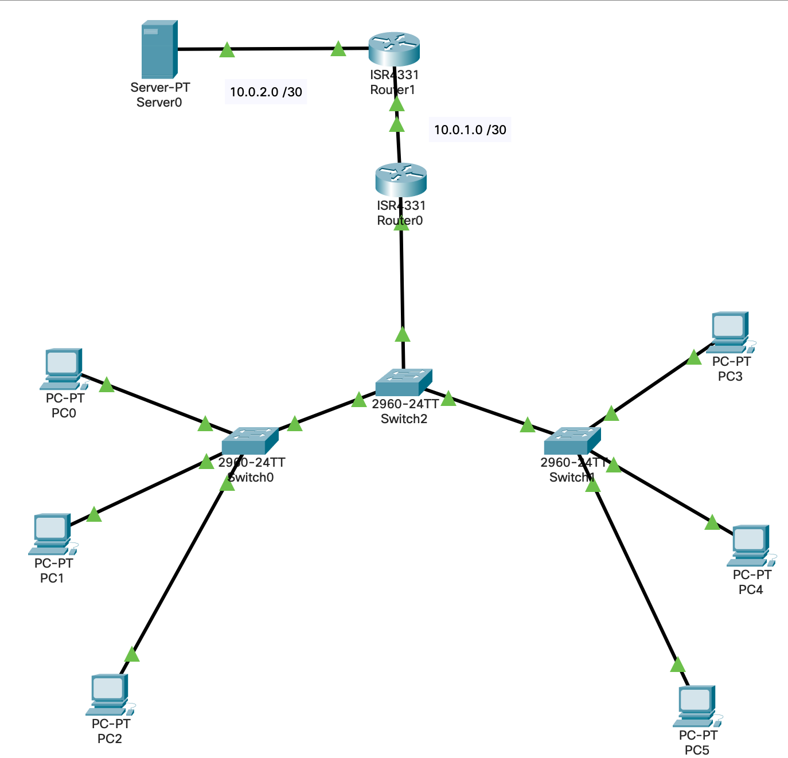

# Лабораторная работа № 12



## Информация о текущей топологии:

### Роутеры и коммутаторы:

| Имя сетевого устройства | IP адреса интерфейсов                                                 | Маска подсети | Что настроенно            |
| ----------------------- | --------------------------------------------------------------------- | ------------- | ------------------------- |
| R0                      | 192.168.10.1 (G0/0/0.10), 192.168.20.1 (G0/0/0.20), G0/0/1 (10.0.1.1) | /24, /24, /30 | Subinterfaces, IP address |
| R1                      | 10.0.1.2 (G0/0/0), 10.0.2.1 (G0/0/1)                                  | /30, /30      | IP addresses              |

### Компьютеры и сервера

| Имя устройства | Что настроено                    | Vlan    |
| -------------- | -------------------------------- | ------- |
| Switch0        | ---                              | ---     |
| Switch1        | ---                              | ---     |
| Switch2        | ---                              | ---     |
| PC0            | IP, subnet mask, default GA, DNS | VLAN 10 |
| PC1            | IP, subnet mask, default GA, DNS | VLAN 20 |
| PC2            | IP, subnet mask, default GA, DNS | VLAN 30 |
| PC3            | IP, subnet mask, default GA, DNS | VLAN 10 |
| PC4            | IP, subnet mask, default GA, DNS | VLAN 20 |
| PC5            | IP, subnet mask, default GA, DNS | VLAN 30 |

## Задание:

1. Настроить корневой Switch0 VTP сервер
2. Добавить каждый компьютер в соотсветствующий VLAN (см. таблицу)
3. Настроить DTP на коммутаторах
4. Протестировать сеть

## Решение
1) SW0:
```
vtp domain lab12
vlan 10,20,30
name IT, Marketing, Bussines
```

2) Добавка компов в vlan:
SW0:
```
int vlan fa0/2
switchport mode access 
switchport access vlan 10
```

3) Настройка DTV:
SW0:
```
int fa0/1
switchport mode dynamic desirable - рассылает предложение стать транком
```
SW1
```
int fa0/1
switchport mode dynamic auto - принимает предложение стать транком
```
4) Пропинговал между vlan, пинг не прохожил. В vlan принг проходит.