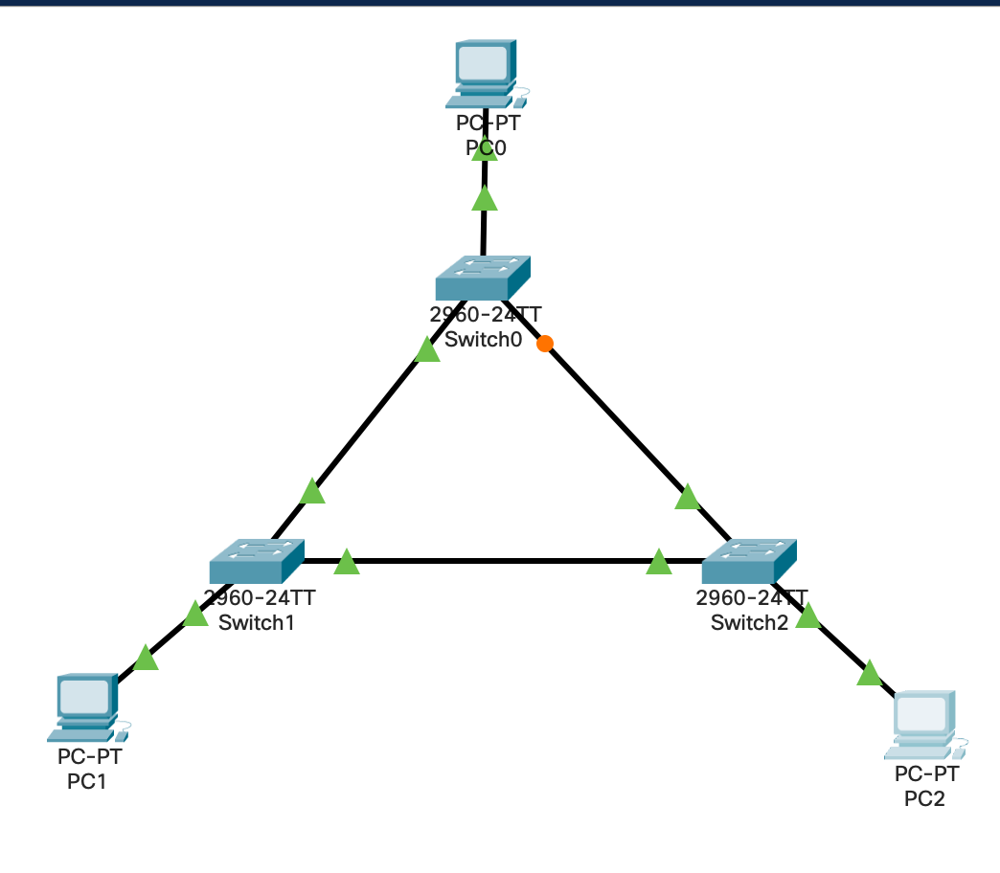

# Лабораторная работа № 14



## Информация о текущей топологии

### Сетевые устройства

| Имя сетевого устройства | IP адреса интерфейсов | Маска подсети | Что настроено      |
| ----------------------- | --------------------- | ------------- | ------------------ |
| Switch0                 | ---                   | ---           | Базовая коммутация |
| Switch1                 | ---                   | ---           | Базовая коммутация |
| Switch2                 | ---                   | ---           | Базовая коммутация |

### Компьютеры

| Имя устройства | IP адрес     | Маска подсети | Default Gateway | Порт на коммутаторе | Что настроено   |
| -------------- | ------------ | ------------- | --------------- | ------------------- | --------------- |
| PC0            | 192.168.1.10 | 255.255.255.0 | ---             | Switch0 Fa0/1       | IP, subnet mask |
| PC1            | 192.168.1.20 | 255.255.255.0 | ---             | Switch1 Fa0/1       | IP, subnet mask |
| PC2            | 192.168.1.30 | 255.255.255.0 | ---             | Switch2 Fa0/1       | IP, subnet mask |

## Задание

1. Создать VLAN 10 на всех коммутаторах.
2. Добавить порты компьютеров в VLAN 10.
3. Настроить trunk-порты между коммутаторами.
4. Проверить работу STP.
5. Определить Root Bridge.
6. Определить Root Port, Designated Port и Blocking/Alternate Port.
7. Назначить Switch0 корневым коммутатором для VLAN 10.
8. Проверить, что Root Bridge изменился на Switch0.
9. Переключить коммутаторы с классического STP на Rapid PVST+.


## Решение
1) Создание vlan 10
```
vlan 10
name users
int fa0/23
switchport mode access
switchport access vlan 10
```
2) Добавление портов
```
int fa0/1
switchport mode access
switchport access vlan 10
```
3) Настройка trunk
```
int fa0/23
switchport mode trunk
switchport trunk allowed vlan 10
```
4) Проверка STP
```
ping [ip]
```
Комьютеры пингуются
5) Определить Root Bridge
```
show spanning-tree vlan 10
```
Если там написано: "This bridge is the root" или у него приоритет ниже чем у других то это означает, что switch является Root Bridge
6) Определить Root Port, Designated Port и Blocking/Alternate Port
```
show spanning tree vlan 10
```
Если у нас петля, то STP блокирует порт и переходит в режим Blocking
У нас Root Port - Forward
7) Назначить switch0 Root Bridge
```
spanning-tree vlan 10 root primary
```
8) Проверить что Root bridge это switch0
```
show spanning tree vlan 10
```
9) Переключить коммутаторы с STP на Rapid PVST+.
```
spanning-tree mode rapid-pvst
```


## Контрольные вопросы

1. Что такое STP?
**Это протокол**
2. Для чего нужен Spanning Tree Protocol?
**Он нужен чтобы найти петли между комутаторами и заблокировать порт, чтобы прервать петлю**
4. Почему loop на L2-уровне опасен?
**Потому что у L2-уровня, тоесть кадра, нет TTL и он будет бегат без остановки**
6. Что такое Root Bridge?
**Главный комаутатор**
7. Как выбирается Root Bridge?
**Сравниваются приорететы, у кого ниже тот главнее**
8. Что такое Bridge ID?
**ID комутатора внутри STP**
9. Из чего состоит Bridge ID?
**priority + MAC_Address**
10. Что важнее при выборе Root Bridge: priority или MAC-адрес?
**Важнее priority**
11. Какая стандартная priority у коммутатора Cisco?
**32768**
12. Что такое Root Port?
**Это интерфейс который ведет до Root Bridge**
13. Что такое Designated Port?
**Это порт для передачи трафика сети**
14. Что такое Blocking Port?
**Это порт, который заблокирван протоколом STP**
15. Почему STP блокирует один из портов?
**STP блокирует порты, чтобы не было петли**
16. Что означает состояние Forwarding?
**Он передает обычный пользовательский трафик**
19. Что делает команда `show spanning-tree`?
**Показывает является ли Root Brigde этот комутатор, роли и состояния**
20. Что делает команда `spanning-tree vlan 10 root primary`?
**Назначает комутатоп в Root Bridge**
21. Как вручную изменить priority коммутатора?
**spanning-tree vlan 10 priority 4096**
22. Что такое RSTP?
**Протокол такойже как STP, но работает быстрее**
23. Чем RSTP отличается от STP?
**RSTP в 10 раз быстрее работает чем STP**
27. Что такое PortFast?
**Это функция для интерфейса к которому подключено конечное устройство**
28. На каких портах можно включать PortFast?
**Только на интерфейсы access**
33. Почему STP важен в реальных сетях?
**Он нужен чтобы кадры не забивали сеть**
34. Что произойдёт, если полностью отключить STP в сети с петлями?
**Среда передачи кадров бы забивалась и сеть просто бы заглючила**
35. Как проверить, какой коммутатор является Root Bridge?
**show spanning-tree**
