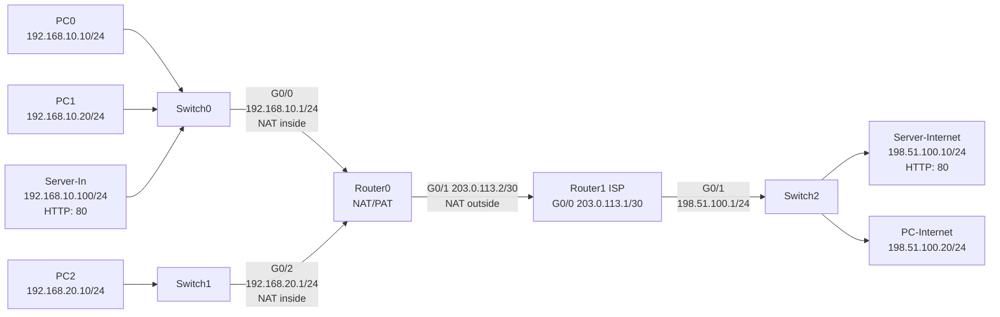

# Лабораторная работа № 15

# Настройка NAT Overload (PAT), проброса портов и поиск неисправностей

## Топология сети



> Для выполнения работы в Cisco Packet Tracer рекомендуется использовать маршрутизаторы Cisco 2911, поскольку Router0 должен иметь три Ethernet-интерфейса.

## Схема подключения устройств

| Устройство 1    | Интерфейс     | Устройство 2 | Интерфейс | Назначение                                  |
| --------------- | ------------- | ------------ | --------- | ------------------------------------------- |
| PC0             | FastEthernet0 | Switch0      | Fa0/1     | Внутренняя сеть 192.168.10.0/24             |
| PC1             | FastEthernet0 | Switch0      | Fa0/2     | Внутренняя сеть 192.168.10.0/24             |
| Server-In       | FastEthernet0 | Switch0      | Fa0/3     | Внутренний HTTP-сервер                      |
| Switch0         | Gi0/1         | Router0      | G0/0      | Подключение первой внутренней сети          |
| PC2             | FastEthernet0 | Switch1      | Fa0/1     | Внутренняя сеть 192.168.20.0/24             |
| Switch1         | Gi0/1         | Router0      | G0/2      | Подключение второй внутренней сети          |
| Router0         | G0/1          | Router1 ISP  | G0/0      | Публичная сеть 203.0.113.0/30               |
| Router1 ISP     | G0/1          | Switch2      | Gi0/1     | Внешняя сеть 198.51.100.0/24                |
| Server-Internet | FastEthernet0 | Switch2      | Fa0/1     | Внешний HTTP-сервер                         |
| PC-Internet     | FastEthernet0 | Switch2      | Fa0/2     | Внешний клиент для проверки проброса портов |

## Информация о текущей топологии

### Маршрутизаторы

| Имя устройства | Интерфейс | IP-адрес     | Маска подсети   | Роль интерфейса | Что должно быть настроено                 |
| -------------- | --------- | ------------ | --------------- | --------------- | ----------------------------------------- |
| Router0        | G0/0      | 192.168.10.1 | 255.255.255.0   | NAT inside      | IP-адрес, `no shutdown`, `ip nat inside`  |
| Router0        | G0/1      | 203.0.113.2  | 255.255.255.252 | NAT outside     | IP-адрес, `no shutdown`, `ip nat outside` |
| Router0        | G0/2      | 192.168.20.1 | 255.255.255.0   | NAT inside      | IP-адрес, `no shutdown`, `ip nat inside`  |
| Router1 ISP    | G0/0      | 203.0.113.1  | 255.255.255.252 | Сеть провайдера | IP-адрес, `no shutdown`                   |
| Router1 ISP    | G0/1      | 198.51.100.1 | 255.255.255.0   | Внешняя сеть    | IP-адрес, `no shutdown`                   |

### Коммутаторы

| Имя сетевого устройства | IP-адрес управления | Что настроено                                     |
| ----------------------- | ------------------- | ------------------------------------------------- |
| Switch0                 | ---                 | Базовая коммутация устройств сети 192.168.10.0/24 |
| Switch1                 | ---                 | Базовая коммутация устройств сети 192.168.20.0/24 |
| Switch2                 | ---                 | Базовая коммутация устройств сети 198.51.100.0/24 |

### Конечные устройства

| Имя устройства  | IP-адрес       | Маска подсети | Default Gateway | Порт на коммутаторе | Дополнительная настройка               |
| --------------- | -------------- | ------------- | --------------- | ------------------- | -------------------------------------- |
| PC0             | 192.168.10.10  | 255.255.255.0 | 192.168.10.1    | Switch0 Fa0/1       | Статическая IPv4-адресация             |
| PC1             | 192.168.10.20  | 255.255.255.0 | 192.168.10.1    | Switch0 Fa0/2       | Статическая IPv4-адресация             |
| Server-In       | 192.168.10.100 | 255.255.255.0 | 192.168.10.1    | Switch0 Fa0/3       | Включить HTTP-сервис на TCP/80         |
| PC2             | 192.168.20.10  | 255.255.255.0 | 192.168.20.1    | Switch1 Fa0/1       | Статическая IPv4-адресация             |
| Server-Internet | 198.51.100.10  | 255.255.255.0 | 198.51.100.1    | Switch2 Fa0/1       | Включить HTTP-сервис на TCP/80         |
| PC-Internet     | 198.51.100.20  | 255.255.255.0 | 198.51.100.1    | Switch2 Fa0/2       | Проверка доступа к проброшенному порту |

## План NAT

| Назначение                          | Внутренний адрес                | Публичный адрес/интерфейс        | Протокол и порт                        | Тип трансляции               |
| ----------------------------------- | ------------------------------- | -------------------------------- | -------------------------------------- | ---------------------------- |
| Выход сети 192.168.10.0/24 наружу   | Любой разрешённый адрес подсети | Адрес Router0 G0/1 — 203.0.113.2 | Динамические TCP/UDP-порты или ICMP ID | NAT Overload/PAT             |
| Выход сети 192.168.20.0/24 наружу   | Любой разрешённый адрес подсети | Адрес Router0 G0/1 — 203.0.113.2 | Динамические TCP/UDP-порты или ICMP ID | NAT Overload/PAT             |
| Публикация внутреннего HTTP-сервера | 192.168.10.100:80               | 203.0.113.2:8080                 | TCP                                    | Static PAT / port forwarding |

## Задание

### Часть 1. Сборка и базовая адресация

1. Собрать топологию в Cisco Packet Tracer согласно схеме подключения.
2. Использовать маршрутизаторы Cisco 2911 для Router0 и Router1 ISP.
3. Назначить IP-адреса всем конечным устройствам согласно таблице.
4. Включить HTTP-сервис на Server-In и Server-Internet.
5. Настроить IP-адреса интерфейсов Router0.
6. Настроить IP-адреса интерфейсов Router1 ISP.
7. Включить все задействованные интерфейсы командой `no shutdown`.
8. Настроить на Router0 маршрут по умолчанию через 203.0.113.1.
9. Проверить локальную связность:
   - PC0 и PC1 должны пинговать 192.168.10.1;
   - PC2 должен пинговать 192.168.20.1;
   - Server-Internet и PC-Internet должны пинговать 198.51.100.1;
   - Router0 должен пинговать 203.0.113.1 и 198.51.100.10.
10. До настройки NAT попытаться выполнить ping с PC0 на 198.51.100.10 и объяснить, почему ответ не возвращается.

### Часть 2. Настройка NAT Overload

11. Обозначить интерфейсы G0/0 и G0/2 маршрутизатора Router0 как `ip nat inside`.
12. Обозначить интерфейс G0/1 маршрутизатора Router0 как `ip nat outside`.
13. Создать стандартный ACL, разрешающий трансляцию сети 192.168.10.0/24.
14. Добавить в этот же ACL сеть 192.168.20.0/24.
15. Настроить NAT Overload с использованием публичного IP-адреса интерфейса G0/1.
16. Очистить старые записи NAT перед первым тестом.
17. С PC0, PC1 и PC2 выполнить ping до 198.51.100.10.
18. На PC0 и PC2 открыть в браузере `http://198.51.100.10`.
19. Проверить таблицу трансляций NAT.
20. Проверить статистику NAT.
21. Определить, какой `inside local` адрес принадлежит каждому внутреннему устройству.
```
show ip nat statictics
```
22. Определить общий `inside global` адрес, используемый внутренними устройствами.
192.168.10.1
192.167.20.1
23. Объяснить, каким образом Router0 различает одновременные соединения PC0, PC1 и PC2.
R0 использует номера портов

### Часть 3. Настройка статического проброса порта

24. Настроить постоянный проброс TCP-порта 203.0.113.2:8080 на внутренний сервер 192.168.10.100:80.
```
show run
```
25. На PC-Internet открыть в браузере `http://203.0.113.2:8080`.
```
ip nat inside source static tcp 192.168.10.100 80 203.0.113.2 8080
```
**PC-Internet стучится во внешний ip address роутера с портом 8080, дальше роутер в своей таблице видет, что запрос пришел на порт 8080 и перенапрявляет трафик на ip address сервера на порт 80**
26. Убедиться, что открывается страница Server-In, а не Server-Internet.
27. Проверить статическую запись в таблице NAT.
```
Router#show ip nat translations
Pro  Inside global     Inside local       Outside local      Outside global
tcp 203.0.113.2:8080   192.168.10.100:80  ---                ---
tcp 203.0.113.2:8080   192.168.10.100:80  198.51.100.20:1025 198.51.100.20:1025
tcp 203.0.113.2:8080   192.168.10.100:80  198.51.100.20:1026 198.51.100.20:1026
tcp 203.0.113.2:8080   192.168.10.100:80  198.51.100.20:1031 198.51.100.20:1031
```
28. Объяснить, почему PC-Internet не может обратиться напрямую к адресу 192.168.10.100.
```
PC-Internet незнает адреса которые скрываются за NAT.
```
29. Объяснить разницу между исходящим NAT Overload и входящим пробросом порта.
**NAT Overload - это исходящий трафик, а проброс порта это входящий трафик**

### Часть 4. Проверка и анализ NAT

30. Выполнить на Router0 команды:
    - `show ip interface brief`;
GigabitEthernet0/0     192.168.10.1    YES manual up
GigabitEthernet0/1     203.0.113.2     YES manual up
GigabitEthernet0/2     192.168.20.1    YES manual up.
Эта команда выводит состояния интерфейсов
    - `show ip route`;
    198.51.100.0/24 [1/0] via 203.0.113.1.
    Эта команда выводит таблицу маршрутизации  
    - `show access-lists`;
    10 permit 192.168.10.0 0.0.0.255
    20 permit 192.168.20.0 0.0.0.255.
    Эта команда выводит сгрупированный пул айпи адрессов access list
    - `show ip nat translations`;
    tcp 203.0.113.2:8080   192.168.10.100:80.
    Эта команда выводит изменение портов и айпи адрессов из внешней во внутрнеюю сеть
    - `show ip nat statistics`;
    Total translations: 1 (1 static, 0 dynamic, 1 extended)
Outside Interfaces: GigabitEthernet0/1
Inside Interfaces: GigabitEthernet0/0 , GigabitEthernet0/2
Hits: 0  Misses: 0
Expired translations: 0
Dynamic mappings:.
Эта команда показывет общее состояние nat
    - `show running-config | include ip nat`.
    ip nat inside source list 1 interface GigabitEthernet0/1 overload
ip nat inside source static tcp 192.168.10.100 80 203.0.113.2 8080.
Эта команда выводит настройки nat
31. Очистить динамические записи командой `clear ip nat translation *`.
32. Убедиться, что статическая запись проброса порта сохраняется или появляется снова как постоянная конфигурация.
```
show ip nat translations
```
33. Переключить Packet Tracer в Simulation Mode и проследить пакет от PC0 до Server-Internet.
34. Сравнить исходный адрес пакета до Router0 и после выхода через G0/1.
До роутера:
source - 192.168.10.10
destination - 198.51.100.10
После роутера:
source - 203.0.113.2
deastination - 192.168.10.10
35. Создать одновременный трафик с PC0, PC1 и PC2 и сравнить записи NAT.
```
show ip nat translation
```
Pro  Inside global     Inside local       Outside local      Outside global
icmp 203.0.113.2:1024  192.168.10.20:1    198.51.100.20:1    198.51.100.20:1024
icmp 203.0.113.2:1025  192.168.20.10:2    198.51.100.20:2    198.51.100.20:1025
icmp 203.0.113.2:1026  192.168.20.10:3    198.51.100.20:3    198.51.100.20:1026
icmp 203.0.113.2:1027  192.168.20.10:4    198.51.100.20:4    198.51.100.20:1027
icmp 203.0.113.2:11    192.168.10.10:11   198.51.100.20:11   198.51.100.20:11
icmp 203.0.113.2:12    192.168.10.10:12   198.51.100.20:12   198.51.100.20:12
icmp 203.0.113.2:13    192.168.10.10:13   198.51.100.20:13   198.51.100.20:13
icmp 203.0.113.2:14    192.168.10.10:14   198.51.100.20:14   198.51.100.20:14
icmp 203.0.113.2:1     192.168.20.10:1    198.51.100.20:1    198.51.100.20:1
icmp 203.0.113.2:2     192.168.10.20:2    198.51.100.20:2    198.51.100.20:2
icmp 203.0.113.2:3     192.168.10.20:3    198.51.100.20:3    198.51.100.20:3
icmp 203.0.113.2:4     192.168.10.20:4    198.51.100.20:4    198.51.100.20:4
tcp 203.0.113.2:8080   192.168.10.100:80  ---                ---
**За счет nat overload может обслуживать сразу несколько устроств и не потаться**

## Troubleshooting: поиск и устранение неисправностей

> Каждый сценарий выполняется отдельно. Перед следующим сценарием восстановите рабочую конфигурацию и очистите динамические трансляции командой `clear ip nat translation *`.

### Сценарий 1. Один компьютер не имеет связи даже со своим шлюзом

1. На PC1 временно изменить Default Gateway на 192.168.10.254.
2. Проверить ping до 192.168.10.1 и 198.51.100.10.
3. Сравнить настройки PC0 и PC1 командой `ipconfig`.
4. Определить причину неисправности.
**Из-за неправильного gateaway пакеты не могут выходит во внешний интернет**
5. Восстановить корректный Default Gateway.

### Сценарий 2. Вторая внутренняя сеть не проходит через NAT

1. На Router0 удалить роль NAT inside с интерфейса G0/2 командой `no ip nat inside`.
2. Проверить доступ PC0 и PC2 к 198.51.100.10.
3. Сравнить состояние интерфейсов G0/0 и G0/2.
4. Использовать `show ip nat statistics` и определить, какие интерфейсы считаются Inside и Outside.
**Нехватает настйроки G0/2, он должен быть внутренний**
5. Восстановить `ip nat inside` на G0/2.

### Сценарий 3. ACL разрешает только одну внутреннюю сеть

1. Удалить из ACL разрешение сети 192.168.20.0/24.
2. Очистить динамические записи NAT.
3. Проверить доступ PC0 и PC2 к Server-Internet.
4. Использовать `show access-lists` и сравнить счётчики совпадений.
**Из-за access-list заработал nat, потому что nat нужен access-list для перенаправления трафика**
5. Добавить отсутствующую сеть обратно в ACL.

### Сценарий 4. Команда NAT ссылается на неправильный ACL

1. Удалить рабочую команду NAT Overload.
2. Настроить NAT Overload с использованием несуществующего ACL 10 вместо ACL 1.
3. Очистить таблицу NAT и создать новый трафик.
4. Проверить `show ip nat translations`, `show ip nat statistics` и `show access-lists`.
5. Определить, почему таблица трансляций остаётся пустой.
**Потому что нет ACL 10**
6. Восстановить ссылку на ACL 1.

### Сценарий 5. На Router0 отсутствует маршрут по умолчанию

1. Удалить маршрут по умолчанию с Router0.
2. Проверить локальные ping до шлюзов внутренних сетей.
3. Проверить ping с Router0 до 203.0.113.1 и 198.51.100.10.
4. Использовать `show ip route`.
5. Объяснить, почему исправная конфигурация NAT не заменяет маршрутизацию.
**Потому что у маршрутизации и NAT разный уровень OSI, маршрутизация нужна для обмена трафика для модели OSI, а NAT нужен для уменьшения кол-во ip адрессов в сети и нужен для защиты локальных сетей**
6. Восстановить маршрут по умолчанию.

### Сценарий 6. Исходящий NAT работает, но проброс порта не работает

1. Заменить внутренний адрес в статическом PAT с 192.168.10.100 на несуществующий 192.168.10.101.
2. Убедиться, что PC0 и PC2 по-прежнему имеют доступ к Server-Internet.
3. Проверить с PC-Internet адрес `http://203.0.113.2:8080`.
4. Использовать `show ip nat translations` и `show running-config | include ip nat`.
5. Найти ошибочный внутренний адрес.
6. Восстановить проброс на 192.168.10.100:80.

## Таблица диагностики

Заполнить после выполнения troubleshooting-сценариев.

| Сценарий | Наблюдаемый симптом | Проверенные команды/настройки | Причина | Исправление |
| -------- | ------------------- | ----------------------------- | ------- | ----------- |
| 1        |PC1 не мог ping внешний ip|ipconfig|неправильный geteaway| исправил на правильный gateaway|
| 2        |PC2 не мог ping 198.51.100.10|   show ip nat statistics |в int g0/2 должен быть настроен на inside|добавил в g0/2 inside|
| 3        |PC2 не мог ping Server-Internet|show access-lists access-list 1 permit 192.168.10.0/20.0 0.0.0.255|без access-list не работал nat и ip adress сетей не были сгруппированы|Настроил access-list|
| 4        |nat неправильно работает из-за отсутствия правильного ACL|show access-lists show run|Неправильный ACL|ip nat inside source list 1 interface GigabitEthernet0/1 overload|
| 5        |R0 не ping внешнюю сеть|show ip route|Неиспраный статический маршрут|ip route 198.51.100.0 255.255.255.0 203.0.113.1|
| 6        |PC-I не открывает веб страницу по адресу http://203.0.113.2:8080|show ip nat translations` и `show running-config | include ip nat|Неправильный внутренний адресс|Новый forwarding для обновленного ip адресса|

## Ожидаемые результаты

| Проверка                              | Ожидаемый результат                                                  |
| ------------------------------------- | -------------------------------------------------------------------- |
| PC0 → 192.168.10.1                    | Успешно                                                              |
| PC2 → 192.168.20.1                    | Успешно                                                              |
| Router0 → 198.51.100.10               | Успешно до настройки NAT                                             |
| PC0 → 198.51.100.10 до NAT            | Неуспешно, поскольку внешняя сеть не знает маршрут к частному адресу |
| PC0 → 198.51.100.10 после NAT         | Успешно                                                              |
| PC1 → 198.51.100.10 после NAT         | Успешно                                                              |
| PC2 → 198.51.100.10 после NAT         | Успешно                                                              |
| PC0 → http://198.51.100.10            | Открывается внешний HTTP-сервер                                      |
| PC-Internet → http://203.0.113.2:8080 | Открывается внутренний Server-In                                     |
| `show ip nat translations`            | Видны динамические PAT-записи и статический проброс TCP/8080         |

## Решение

## Контрольные вопросы

1. Что такое NAT?
**NAT это механизм который позволяет внутренним ip адрессам пользоваться одним публичным**
2. Для чего применяется NAT?
**Он нужен для уменьшения ip адрессов и защиты внетренней сети**
3. Что такое частный IPv4-адрес?
**Это те ip адресса которые находяться за NAT**
4. Какие диапазоны IPv4-адресов зарезервированы для частных сетей?
**10.0.0.0/8,172.16.0.0/12,192.168.0.0/16**
5. Почему частный адрес обычно не маршрутизируется в Интернете?
**Потому что его не видно, тк он существуем внутри локальной сети**
6. Что такое Static NAT?
**Каждый ip адресс роутера соответствует ip адрессу компьютера**
7. Что такое Dynamic NAT?
**ip адресса роутеров могут обслуживать несколько ip адрессов компьютеров**
8. Что такое NAT Overload?
**Режим работы, когда роутер принимает пакеты из внешней сети на 1 ip адресс внешнего интернета и отправляет его во внютренюю сеть за счёт портов**
9. Что такое PAT?
**Это название NAT Overload**
10. Являются ли NAT Overload и PAT одним и тем же механизмом в контексте Cisco IOS?
**Да**
11. Почему несколько компьютеров могут использовать один публичный IP-адрес?
**Потому что маршрутизатор различает соединения по портам**
12. Как PAT различает соединения разных внутренних устройств?
**По таблице translation**
13. Что происходит с source IP-адресом исходящего пакета?
**source заменяется на ip адресс интерфейса котороый смотрит в глобальный интернет**
14. Что происходит с source TCP/UDP port при PAT?
**Порт может быть заменен другим уникальным портом, чтобы маршрутизатор мог отличить одновременные соединения**
15. Использует ли ICMP TCP- или UDP-порты?
**Нет**
16. Что используется для различения ICMP-трансляций?
17. Что такое inside local address?
**Это внутренний ip адресс локольной сети**
18. Что такое inside global address?
**Это внещний ip адресс роутера с PAT**
19. Что такое outside local address?
**Это внутренний ip адресс который представлен во внешней сети**
20. Что такое outside global address?
**Глобальный адресс внешнего устройства**
21. Что означает команда `ip nat inside`?
**Она назначает интерфейс внутрениим для nat**
22. Что означает команда `ip nat outside`?
**Она назначает интерфейс внешним для nat**
23. Для чего NAT использует ACL?
**Он объединяет ip адресса и покахывает nat с чем ему работать**
24. Блокирует ли стандартный ACL в этой конфигурации обычный транзитный трафик?
**ACL не блокирует трафик, потому что ACL используется для группировки**
25. Что делает ключевое слово `overload`?
**Делает nat перегруженным**
26. Что делает команда `ip nat inside source list 1 interface g0/1 overload`?
**Команда создает nat внутри ACL на интерфейсе g0/1 и делает его перегруженным**
27. Что показывает команда `show ip nat translations`?
**Показывает таблицу маршрутизации**
28. Что показывает команда `show ip nat statistics`?
**Показывает статистику прошедших покетов через роутер**
29. Для чего используется `clear ip nat translation *`?
**Для траблшутинга nat**
30. Почему после изменения ACL полезно очистить старые трансляции?
**Для удобства, чтобы  не запутаться нде новый, а гдк старый ACL**
31. Что такое static PAT?
**Это когда в глобальную и внутренюю сеть смотрит одмн и тот же порт**
32. Что такое port forwarding?
**Это проброс портов чтобы пакеты могли ходить между сетями, один порт который смотрить в глобальную сеть, а другой во внутренюю**
33. Что означает соответствие 203.0.113.2:8080 → 192.168.10.100:80?
**203.0.113.2:8080 - это ip интерфейса который смотрит в глобальную сеть, это переход из внешней сети во внютренюю по средставам проброса портов**
34. Можно ли пробросить один и тот же внешний TCP-порт одновременно на два разных внутренних сервера?
**Нет, нельзя потому что роутер не разбереться на какой из серверов отправляется запрос**
35. Можно ли использовать один номер порта отдельно для TCP и UDP?
**TCP и UDP — независимые протоколы, поэтому порты могут использоваться одновременно**
36. Почему для доступа к внутреннему серверу извне недостаточно одного NAT Overload?
**NAT Overload не умеет сам запускать входящие соединения извне. Ему нужно статическое правило, чтобы знать, кому изнутри адресовать внешний запрос**
37. Почему NAT не заменяет маршрут по умолчанию?
**Маршрут по умолчанию указывает, куда отправлять пакеты, а NAT изменяет, что внутри пакета**
38. Почему корректный маршрут не заменяет настройку NAT?
**Маршрут отвечает за передачу пакетов, а NAT — за трансляцию адресов**
39. Что произойдёт, если перепутать NAT inside и NAT outside?
**Трансляция не сработает, роутер будет искать inside адреса там, где их нет**
40. Что произойдёт, если ACL NAT не включает одну из внутренних подсетей?
**Хост из отключенной подсети не получит доступ в интернет**
41. Что произойдёт, если интерфейс G0/1 находится в состоянии shutdown?
**Трафик через этот интерфейс идти не будет, и доступ в интернет пропадет**
42. Почему при troubleshooting сначала проверяют интерфейсы и маршрутизацию, а затем NAT?
**Если интерфейс упал или нет маршрута, пакет до Nat не дойдет**
43. В каком порядке рекомендуется проверять неисправность: адресация, интерфейсы, маршруты, ACL, NAT или приложения?
**Адресация - Интерфейсы - Маршруты - ACL - NAT - Приложения**
44. Является ли NAT полноценным межсетевым экраном?
**Нет, Nat не анализирует трафик на предмет угроз и не блокирует явные атаки.**
45. Какие ограничения создаёт NAT для входящих соединений?
**Входящие соединения невозможны, если для них не настроено правило**
46. Какие проблемы NAT может создавать для протоколов, передающих IP-адреса внутри полезной нагрузки?
**Протоколы FTP или SIP вставляют IP-адрес в пакет. NAT не меняет содержимое, из-за чего соединение разрывается**
47. Зачем в Packet Tracer использовать Simulation Mode при изучении NAT?
**Он позволяет увидеть пошагово, как пакет меняет IP-адрес на каждом интерфейсе, что показывет работу трансляции.**
48. Как определить, создаются ли новые записи NAT при генерации трафика?
**Надо прописать команду show ip nat translations, если появляются новые записи или новые строки - записи создаются.**
49. Почему первый ping иногда может быть потерян даже при правильной конфигурации?
**Из-за ARP-запроса, первый пинг отправляет ARP-запрос для поиска MAC-адреса, а ответа на ICMP-запрос ждать неоткуда**
50. Как доказать, что три внутренних компьютера используют один и тот же публичный IP-адрес?
**Надо зайти на маршрутизатор и выполнить команду show ip nat translations, будет видно, что у всех трех внутренних адресов Inside Local в столбце Outside Global указан один и тот же публичный IP, но разные порты**
