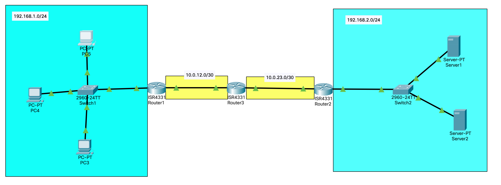

# Лабораторная работа № 2



## Информация о текущей топологии:

### Роутеры и коммутаторы:

| Имя сетевого устройства | IP адреса интерфейсов                    | Маска подсети | Что настроенно                       |
| ----------------------- | ---------------------------------------- | ------------- | ------------------------------------ |
| R1                      | 192.168.1.1 (G0/0/0), 10.0.12.1 (G0/0/1) | /24, /30      | IP Адреса, DHCP, Статический маршрут |
| R2                      | 192.168.2.1 (G0/0/1), 10.0.23.2 (G0/0/0) | /24, /30      | IP Адреса, Статический маршрут       |
| R3                      | 10.0.12.1 (G0/0/0), 10.0.23.1 (G0/0/1)   | /30, /30      | Статический маршрут                  |
| S1                      | ---                                      | ---           | ---                                  |
| S2                      | ---                                      | ---           | ---                                  |

### Компьютеры

| Имя устройства | IP адрес      | Маска подсети | Что настроенно |
| -------------- | ------------- | ------------- | -------------- |
| PC1            | Отсутсвует    | Отсутсвует    | Отсутсвует     |
| PC2            | Отсутсвует    | Отсутсвует    | Отсутсвует     |
| PC3            | Отсутсвует    | Отсутсвует    | Отсутсвует     |
| Server 1       | 192.168.2.160 | /24           | DNS            |
| Server 2       | 192.168.2.159 | /24           | HTTP           |

## Проблема:

Компьютеры в сети 192.168.1.0/24 должны получать сетевые настройки динамическим образом, но при выборе настройки о получение данных динамически, данные приходят неверные и выводится ошибка. При попытке перейти на любом из компьютеров на сайт example.ru, сайт не открывается, пакеты не доходят.

## Гипотезы решения

1) Для текущей маски подсети не будет хватать айпи адресов для всех устройств
2) На 3 роутере не указан статический маршрут
3) На всех роутерах не указан обратный маршрут для пакетов


Отпрвавил ICMP запрос с pc5 до DNS сервера. Пакет застрял на 2 роутере.


## Решение
DHCP:
1) Зайти в консоль роутера
2) Зайти в режим конфигурации (conf t)
3) Зайти в pool (ip dhcp pool main)
4) Маску под сети изменил, потому что с маской 255.255.255.252 не хватало айпи адресов, поэтому я взял обычную маску с 0.
5) Проверить в файле что все применилось(нужно зайти в режим enable и прописать команду show running-config)

Static route:
1) Зайти в консоль
2) Зайти в режим конфигурации (conf t)
3) На 3 роутере написал путь до 1 сети (192.168.1.0) и он идет через интерфейс (10.0.12.1-route1) 
```
ip route 192.168.1.0 255.255.255.0 10.0.12.1
````
4) На 2 роутере написал статический маршрут до 1 сети(192.168.1.0) который идет через интерфейс(10.0.23.1-route3)
```
ip route 192.168.1.0 255.255.255.0 10.0.23.1
```

В итоге:
ICMP,DNS,HTTP запрос проходит от компьтеров до серверов.
