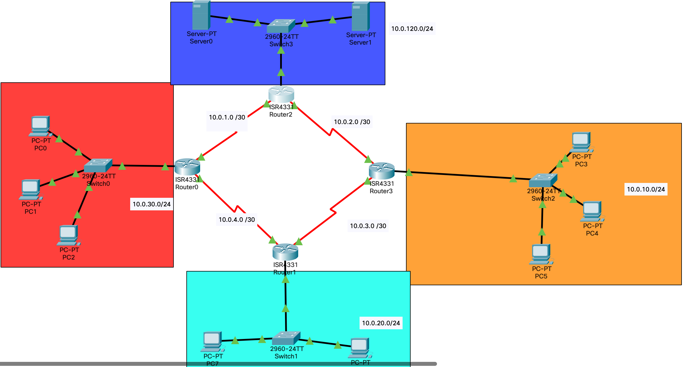

# Лабораторная работа № 3



## Информация о текущей топологии:

### Роутеры и коммутаторы:

| Имя сетевого устройства | IP адреса интерфейсов                                       | Маска подсети | Что настроенно                       |
| ----------------------- | ----------------------------------------------------------- | ------------- | ------------------------------------ |
| R0                      | 10.0.1.1 (Se0/1/1), 10.0.4.1 (Se0/1/0), 10.0.30.1 (G0/0/0)  | /30, /30, /24 | IP Адреса, Статический маршрут, DHCP |
| R1                      | 10.0.4.2 (Se0/1/0), 10.0.3.2 (Se0/1/1), 10.0.20.0 (G0/0/0)  | /30, /30, /24 | IP Адреса, Статический маршрут, DHCP |
| R2                      | 10.0.1.2 (Se0/1/0), 10.0.2.1 (G0/1/1), 10.0.120.1 (Ge0/0/0) | /30, /30, /24 | IP Адреса, DHCP                      |
| R3                      | 10.0.2.2 (G0/1/0), 10.0.3.1 (S0/1/1), 10.0.10.0 (G0/0/0)    | /30, /30, /24 | IP Адреса, Статический маршрут, DHCP |
| S0                      | ---                                                         | ---           | ---                                  |
| S1                      | ---                                                         | ---           | ---                                  |
| S2                      | ---                                                         | ---           | ---                                  |
| S3                      | ---                                                         | ---           | ---                                  |

### Компьютеры и сервера

| Имя устройства | IP адрес     | Маска подсети | Что настроенно                                |
| -------------- | ------------ | ------------- | --------------------------------------------- |
| PC0            | Динамический | /24           | IP адрес, маска подсети, маршрут по умолчанию |
| PC1            | Динамический | /24           | IP адрес, маска подсети, маршрут по умолчанию |
| PC2            | Динамический | /24           | IP адрес, маска подсети, маршрут по умолчанию |
| PC3            | Динамический | /24           | IP адрес, маска подсети, маршрут по умолчанию |
| PC4            | Динамический | /24           | IP адрес, маска подсети, маршрут по умолчанию |
| PC5            | Динамический | /24           | IP адрес, маска подсети, маршрут по умолчанию |
| PC6            | Динамический | /24           | IP адрес, маска подсети, маршрут по умолчанию |
| PC7            | Динамический | /24           | IP адрес, маска подсети, маршрут по умолчанию |
| Server 0       | 10.0.120.80  | /8            | HTTP                                          |
| Server 1       | 10.0.120.90  | /8            | DNS                                           |

## Задача:

Настроить доступ по SSH ко всем роутерам в сети и обезопасить их паролями на:

1. линии vty
2. Консольный доступ
3. Баннер (All configs are defended by the law)
4. Пароль на привилигированный доступ

## Решение
1) Настроил линии vty, командами:
```
line vty 0 15 
login
```
2) Настроил консольный доступ:
```
line consol 0
password "password"
login
```
3) Банер:
```
banner motd #words#
```
4) Настройка паролей привилигованный режим:
```
enable secret "password"
```
Настройка ssh:

1) Создать доменное имя:
```
ip domain name "switch1.local"
```
2) Задать hostname:
```
hostname switch1
```
3) Генерация ключа rsa:
```
crypto key generate rsa
# указавается значение больше 756 тк используется shh.2
```
4) Создать пользователя с паролем:
```
username admin secret "password"
```
5) Запретить вход по tellnet
```
line vty 0 15
transport input ssh
```
