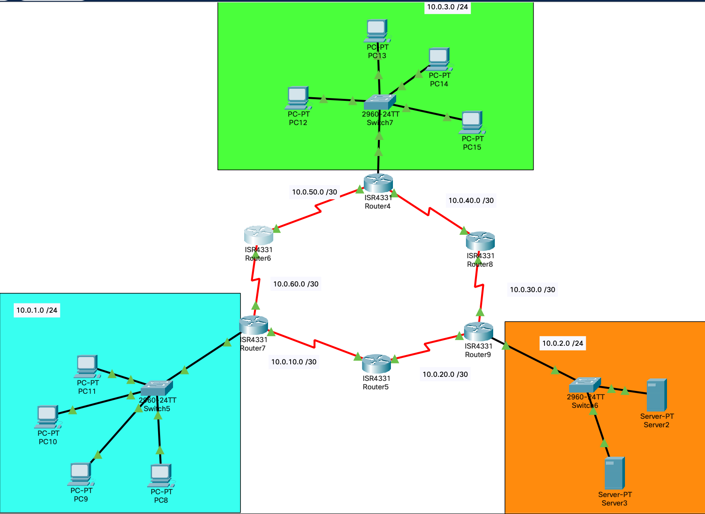

# Лабораторная работа № 3



## Информация о текущей топологии:

### Роутеры и коммутаторы:

| Имя сетевого устройства | IP адреса интерфейсов                                       | Маска подсети | Что настроенно         |
| ----------------------- | ----------------------------------------------------------- | ------------- | ---------------------- |
| R4                      | 10.0.40.2 (Se0/1/0), 10.0.50.1 (Se0/1/1), 10.0.3.1 (G0/0/0) | /30, /30, /24 | IP Адреса, RIPv2, DHCP |
| R5                      | 10.0.10.2 (Se0/1/0), 10.0.20.1 (Se0/1/1)                    | /30, /30      | IP Адреса, RIPv2       |
| R6                      | 10.0.50.2 (Se0/1/0), 10.0.60.1 (Se0/1/1)                    | /30, /30      | IP Адреса, RIPv2       |
| R7                      | 10.0.60.2 (Se0/1/1), 10.0.10.1 (Se0/1/0), 10.0.1.1 (G0/0/0) | /30, /30, /24 | IP Адреса, RIPv2, DHCP |
| R8                      | 10.0.30.2 (Se0/1/0), 10.0.40.1 (Se0/1/1)                    | /30, /30      | IP Адреса, RIPv2       |
| R9                      | 10.0.20.2 (Se0/1/0), 10.0.30.1 (S0/1/1), 10.0.2.1 (G0/0/0)  | /30, /30, /24 | IP Адреса, RIPv2, DHCP |
| S5                      | ---                                                         | ---           | ---                    |
| S6                      | ---                                                         | ---           | ---                    |
| S7                      | ---                                                         | ---           | ---                    |

### Компьютеры и сервера

| Имя устройства | IP адрес     | Маска подсети | Что настроенно                                |
| -------------- | ------------ | ------------- | --------------------------------------------- |
| PC0            | Динамический | /24           | IP адрес, маска подсети, маршрут по умолчанию |
| PC1            | Динамический | /24           | IP адрес, маска подсети, маршрут по умолчанию |
| PC2            | Динамический | /24           | IP адрес, маска подсети, маршрут по умолчанию |
| PC3            | Динамический | /24           | IP адрес, маска подсети, маршрут по умолчанию |
| PC4            | Динамический | /24           | IP адрес, маска подсети, маршрут по умолчанию |
| PC5            | Динамический | /24           | IP адрес, маска подсети, маршрут по умолчанию |
| PC6            | Динамический | /24           | IP адрес, маска подсети, маршрут по умолчанию |
| PC7            | Динамический | /24           | IP адрес, маска подсети, маршрут по умолчанию |
| Server 2       | 10.0.2.160   | /24           | HTTP                                          |
| Server 1       | 10.0.2.150   | /24           | DNS                                           |

## Проблема:

1. На роутерах настроенна динамическая маршрутизация через протокол RIPv2, но у некоторых подсетей нет доступа к другим подесетям
2. В подсети 10.0.1.0/24 не работает DHCP
3. На всех коммутаторах настроить пароли на:
   а) Линии vty
   б) Привелигированный доступ
   в) Консольный кабель
   г) Настроить доступ по SSH

## Гипотезы решения
DHCP:
1) Ошибка в default gateway
RIP:
1) На роутерах настроены не правильные напрямую подключенные сети
2) На роутере 8 не был настроен RIPv2

## Решение
DHCP:
1) Исправил ошибку на роутере 7
```
ip dhcp pool blue
default-router 10.0.1.1
```
RIP:
1) У всех роутеров удалил не праильную сеть 10.0.0.0
```
router rip
no network 10.0.0.0
```
2) Указал правильные сети
```
network <10.0.1.0>
```
3) Настроил полностью RIP на 8 роутере
```
router rip
version 2
no auto-summary
network <10.0.1.0>
```
Настройка паролей:
1) Консольный кабель
```
line console 0
password "password"
login
```
2) Привелигированный доступ
```
enable secret "password"
```
3) line vty
```
line vty 0 15
password "password"
login
```
4) Шифровка всех паролей
```
service password-encryption
```

Настройка ssh:

1) Создать доменное имя:
```
ip domain name "switch1.local"
```
2) Задать hostname:
```
hostname switch1
```
3) Генерация ключа rsa:
```
crypto key generate rsa
# указавается значение больше 756 тк используется shh.2
```
4) Создать пользователя с паролем:
```
username admin secret "password"
```
5) Запретить вход по tellnet
```
line vty 0 15
transport input ssh
```
6) Путь до выходного шлюза
```
ip default-gateaway 10.0.2.1
```
7) 2 версия ssh
```
ssh version 2
```
8) Создание vlan для подключения для него ssh
```
int vlan 1
ip address 10.0.1.190 255.255.255.0
no shutdown
```

