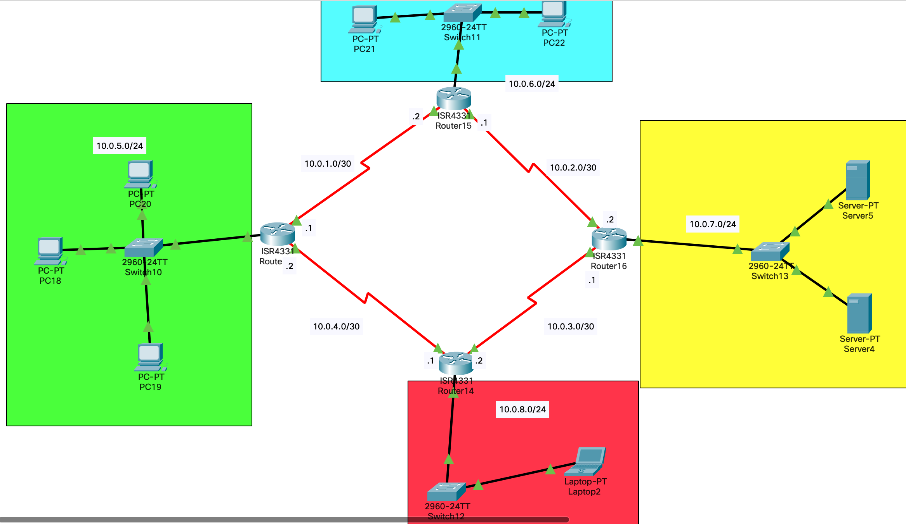

# Лабораторная работа № 3



## Информация о текущей топологии:

### Роутеры и коммутаторы:

| Имя сетевого устройства | IP адреса интерфейсов                                     | Маска подсети | Что настроенно        |
| ----------------------- | --------------------------------------------------------- | ------------- | --------------------- |
| R13                     | 10.0.1.1 (Se0/1/0), 10.0.4.2 (Se0/1/1), 10.0.5.1 (G0/0/0) | /30, /30, /24 | IP Адреса, OSPF, DHCP |
| R14                     | 10.0.3.2 (Se0/1/0), 10.0.4.1 (Se0/1/1), 10.0.8.1 (G0/0/0) | /30, /30, /24 | IP Адреса, OSPF       |
| R15                     | 10.0.2.1 (Se0/1/0), 10.0.1.2 (Se0/1/1), 10.0.6.1 (G0/0/0) | /30, /30      | IP Адреса, OSPF       |
| R16                     | 10.0.2.2 (Se0/1/1), 10.0.3.1 (Se0/1/0), 10.0.7.1 (G0/0/0) | /30, /30, /24 | IP Адреса             |
| S10                     | ---                                                       | ---           | ---                   |
| S11                     | ---                                                       | ---           | ---                   |
| S12                     | ---                                                       | ---           | ---                   |
| S13                     | ---                                                       | ---           | ---                   |

### Компьютеры и сервера

| Имя устройства | IP адрес     | Маска подсети | Что настроенно                                     |
| -------------- | ------------ | ------------- | -------------------------------------------------- |
| PC18           | Динамический | /24           | IP адрес, маска подсети, маршрут по умолчанию, DNS |
| PC19           | Динамический | /24           | IP адрес, маска подсети, маршрут по умолчанию, DNS |
| PC20           | Динамический | /24           | IP адрес, маска подсети, маршрут по умолчанию, DNS |
| PC21           | 10.0.6.5     | /24           | IP адрес, маска подсети, маршрут по умолчанию      |
| PC22           | 10.0.6.6     | /24           | IP адрес, маска подсети, маршрут по умолчанию      |
| Laptop 2       | 10.0.8.2     | /24           | IP адрес, маска подсети, маршрут по умолчанию, DNS |
| Server 5       | 10.0.7.2     | /24           | HTTP                                               |
| Server 1       | 10.0.7.4     | /24           | DNS                                                |

## Проблема:

1. Ни одно устройство не может попасть в сеть 10.0.7.0
2. Компьютеры в сети 10.0.5.0 получает неправильный IP адрес DNS сервера от DHCP сервера
3. Laptop 2 должен иметь SSHv2 доступ к Switch 11
4. Ни одно из устройств не могут получить доступ к сети 10.0.8.0/24
5. На Http сервере исправить index.html файл так, чтобы он отображал твою имя и фамилию в заголовке первого уровня

## Гипотезы решения
1) Был неправлиьный ip адрес в настройках dhcp для dns сервера
2) У 14 роутера не хватало нарпямую подключенной сети 10.0.4.0/30
3) У 16 не был настроен OSPF вообще
4) У 15 роутера не хватало напрямую подключенной сети 10.0.6.0/24

## Решение

1) Исправил в настройках dhcp ip адрес dns сервера на правильный

2) Добавил 16 роутер в network OSPF:
```
router ospf 1
network 10.0.3.0 0.0.0.3
network 10.0.2.0 0.0.0.3
network 10.0.7.0 0.0.0.255
```
3) На роутере 14 добавил сеть:
```
router ospf 1
network 10.0.4.0 0.0.0.3
```
4) На роутере 15 добавил сеть:
```
router ospf 1
network 10.0.6.0 0.0.0.255
```
5) Удалил содержимое файла index.html и написал заголовок:
```
<html>
<h1>Hello Mikhail Smyshnikov</h1>

</html>
```
6) Настроил SSHv2 на switch11:
```
ip domain name switch11.local
username switch11
```
```
line vty 0 15
password <password>
login
transport input ssh
crypro key generate rsa(1024)
ssh version 2
```
```
int vlan 1
ip address 10.0.6.90 255.255.255.0
no shutdown
```


