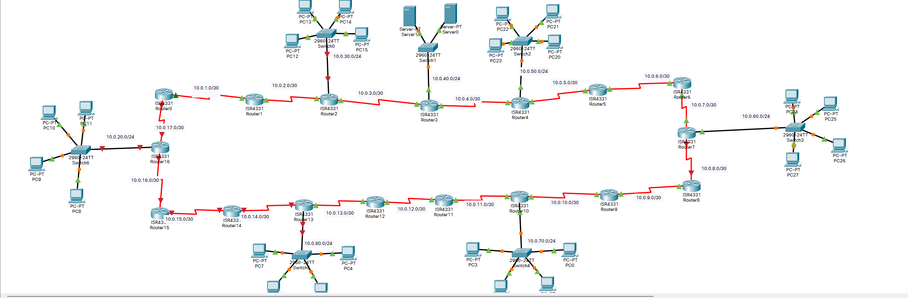

 # Лабораторная работа № 7
 

## Информация о текущей топологии:

### Роутеры и коммутаторы:

| Имя сетевого устройства| IP адреса интерфейсов                                    | Маска подсети | Что настроенно       |
| -----------------------| ---------------------------------------------------------| ------------- | ---------------------|
| R0                     | 10.0.1.2 (Se0/1/0), 10.0.17.1 (Se0/1/1),|| IP Адреса, OSPF,|
| R1                     | 10.0.1.1 (Se0/1/0), 10.0.2.2 (Se0/1/1), || IP Адреса, OSPF,|
| R2                     | 10.0.2.1 (Se0/1/0), 10.0.3.2 (Se0/1/1), 10.0.30.1 (G0/0/0) | /30, /30, /24 | IP Адреса, OSPF, DHCP |
| R3                     | 10.0.3.1 (Se0/1/0), 10.0.4.2 (Se0/1/1), 10.0.40.1 (G0/0/0) | /30, /30, /24 | IP Адреса, OSPF, DHCP |
| R4                     | 10.0.4.1 (Se0/1/0), 10.0.5.2 (Se0/1/1), 10.0.50.1 (G0/0/0) | /30, /30, /24 | IP Адреса, OSPF, DHCP |
| R5                     | 10.0.5.1 (Se0/1/0), 10.0.6.2 (Se0/1/1),|| IP Адреса, OSPF, |
| R6                     | 10.0.6.1 (Se0/1/0), 10.0.7.2 (Se0/1/1),|| IP Адреса, OSPF, |
| R7                     | 10.0.7.1 (Se0/1/0), 10.0.8.2 (Se0/1/1), 10.0.60.1 (G0/0/0) | /30, /30, /24 | IP Адреса, OSPF, DHCP |
| R8                     | 10.0.8.1 (Se0/1/0), 10.0.9.2 (Se0/1/1),|| IP Адреса, OSPF, |
| R9                     | 10.0.9.1 (Se0/1/0), 10.0.10.2 (Se0/1/1),|| IP Адреса, OSPF, |
| R10                    | 10.0.10.1 (Se0/1/0), 10.0.11.2 (Se0/1/1), 10.0.70.1 (G0/0/0) | /30, /30, /24 | IP Адреса, OSPF, DHCP |
| R11                    | 10.0.11.1 (Se0/1/0), 10.0.12.2 (Se0/1/1),|| IP Адреса, OSPF, |
| R12                    | 10.0.12.1 (Se0/1/0), 10.0.13.2 (Se0/1/1),|| IP Адреса, OSPF, |
| R13                    | 10.0.13.1 (Se0/1/0), 10.0.14.2 (Se0/1/1), 10.0.80.1 (G0/0/0) | /30, /30, /24 | IP Адреса, OSPF, DHCP |
| R14                    | 10.0.14.1 (Se0/1/0), 10.0.15.2 (Se0/1/1),|| IP Адреса, OSPF, |
| R15                    | 10.0.15.1 (Se0/1/0), 10.0.16.2 (Se0/1/1),|| IP Адреса, OSPF, |
| R16                    | 10.0.16.1 (Se0/1/0), 10.0.17.2 (Se0/1/1), 10.0.20.1 (G0/0/0) | /30, /30, /24 | IP Адреса, OSPF, DHCP |


### Компьютеры и сервера

| Имя устройства | IP адрес     | Маска подсети | Что настроенно                                     |
| -------------- | ------------ | ------------- | -------------------------------------------------- |
| PC1           | Динамический | /24           | IP адрес, маска подсети, маршрут по умолчанию, DNS |
| PC2           | Динамический | /24           | IP адрес, маска подсети, маршрут по умолчанию, DNS |
| PC3           | Динамический | /24           | IP адрес, маска подсети, маршрут по умолчанию, DNS |
| PC4           | Динамический | /24           | IP адрес, маска подсети, маршрут по умолчанию, DNS |
| PC5           | Динамический | /24           | IP адрес, маска подсети, маршрут по умолчанию, DNS |
| PC6           | Динамический | /24           | IP адрес, маска подсети, маршрут по умолчанию, DNS |
| PC7           | Динамический | /24           | IP адрес, маска подсети, маршрут по умолчанию, DNS |
| PC8           | Динамический | /24           | IP адрес, маска подсети, маршрут по умолчанию, DNS |
| PC9           | Динамический | /24           | IP адрес, маска подсети, маршрут по умолчанию, DNS |
| PC10           | Динамический | /24           | IP адрес, маска подсети, маршрут по умолчанию, DNS |
| PC11           | Динамический | /24           | IP адрес, маска подсети, маршрут по умолчанию, DNS |
| PC12           | Динамический | /24           | IP адрес, маска подсети, маршрут по умолчанию, DNS |
| PC13           | Динамический | /24           | IP адрес, маска подсети, маршрут по умолчанию, DNS |
| PC14           | Динамический | /24           | IP адрес, маска подсети, маршрут по умолчанию, DNS |
| PC15           | Динамический | /24           | IP адрес, маска подсети, маршрут по умолчанию, DNS |
| PC16           | Динамический | /24           | IP адрес, маска подсети, маршрут по умолчанию, DNS |
| PC17           | Динамический | /24           | IP адрес, маска подсети, маршрут по умолчанию, DNS |
| PC18           | Динамический | /24           | IP адрес, маска подсети, маршрут по умолчанию, DNS |
| PC19           | Динамический | /24           | IP адрес, маска подсети, маршрут по умолчанию, DNS |
| PC20           | Динамический | /24           | IP адрес, маска подсети, маршрут по умолчанию, DNS |
| PC21           | Динамический | /24           | IP адрес, маска подсети, маршрут по умолчанию, DNS |
| PC22           | Динамический | /24           | IP адрес, маска подсети, маршрут по умолчанию, DNS |
| PC23           | Динамический | /24           | IP адрес, маска подсети, маршрут по умолчанию, DNS |
| PC24           | Динамический | /24           | IP адрес, маска подсети, маршрут по умолчанию, DNS |
| SERVER0(DNS)   |10.0.40.80| /24             | 255.255.255.0, маршрут по умолчанию, DNS |
| SERVER1(HTTP)  |10.0.40.90| /24               | 255.255.255.0, маршрут по умолчанию, DNS |


## Проблема:

Сеть состоит из 17 роутеров. В каждой четвертой сети должно быть по 4 компьютера. В одной из сетей должно быть 2 сервера (1 DNS и 1 HTTP). Выбрать необходимый протокол динамической маршрутизации, обосновать свое решение и настроить его. Также настроить DHCP сервера во всех подсетях где есть компьютеры. Для всех коммутаторов настроить пароли на vty линии, консольные линии и привилигерованный режим. Сделать SSH доступ ко всем коммутаторам в сети. IP адреса на серверах статические. Настроить passive-interface на нужных роутерах и обосновать зачем это нужно. Скриншот финальной топологии прикрепить в отчет.

## Решение

Я выбрал протокол ospf, так как он имеет больше 15 хопов что и нужно для сети. Также протокол ospf работает быстрее и лучше, чем остальные потому что на роутерах циско хорошо поддерживается этот протокол для диначической маршрутизации.

Что бы его настроить:

1) Запускает процесс OSPF с process ID = 1:
```
router ospf 1
```
2) Объявляет, какие интерфейсы должны участвовать в OSPF:
```
network 10.0.1.0 0.0.0.3 area 1
```
Настройка пароли на vty линии, консольные линии и привилигерованный режим:

1) line vty
```
line vty 0 15
password "qwerty"
login
```
2) Консольные линии:
```
line consol 0
password "qwerty"
login
```
3) Привилигерованный режим:
```
enable-secret "qwerty"
```
4) Шифровка:
```
 service password-encryption
```
SSH доступ:

1) Зайти в line vty
```
line vty 0 15
```
2) Указать domain name
```
ip domain name "switch1.local"
```
3) Указать hostname
```
hostname "switch1"
```
4) Разрешить входящие подключения только по протоколу SSH 
```
transport input ssh
```
5) Сгенерировать ключ для ssh
```
crypro key generate rsa(1024)
```
6) Указать 2 версию ssh
```
ssh version 2
```
7) Настройка vlan:
```
int vlan 1
ip address 10.0.6.90 255.255.255.0
no shutdown
```
Настройка passive-interface:
Он запрещает отправку Hello-пакетов OSPF через указанный интерфейс

1) Запускает процесс OSPF с process ID = 1:
```
router ospf 1
```
2) Делать все интерфейсы пассивными:
```
passive-interface default
```
3) Отменять пассивность только на интерфейсе, где есть соседний маршрутизатор:
```
no passive-interface gigabitEthernet 0/0
```

