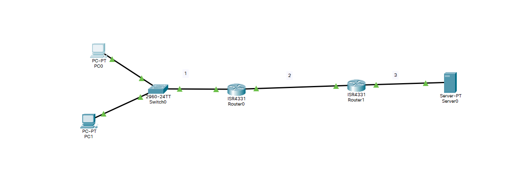

# Лабораторная работа № 8

## Информация о текущей топологии:

### Роутеры и коммутаторы:

| Имя сетевого устройства | IP адреса интерфейсов                  | Маска подсети | Что настроенно |
| ----------------------- | -------------------------------------- | ------------- | -------------- |
| R1                      | 192.168.2.1 (G0/1), 192.168.1.1 (G0/0) | /30, /24      | ---            |
| R2                      | 192.168.2.2 (G0/0), 192.168.3.1 (G0/1) | /30 /24       | ---            |

### Компьютеры и сервера

| Имя устройства | IP адрес    | Маска подсети | Что настроенно |
| -------------- | ----------- | ------------- | -------------- |
| PC1            | 192.168.1.2 | /24           | ---            |
| PC2            | 192.168.1.3 | /24           | ---            |
| Server0        | 192.168.3.2 | /24           | ---            |

### Настройки для пользователей для email сервера

| Имя устройства | Name      | Email address         | Incoming email server | Outgoing Email Server | User name | Password  |
| -------------- | --------- | --------------------- | --------------------- | --------------------- | --------- | --------- |
| PC1            | Mikhail   | mikhail@outlook.com   | Server0               | Server0               | mikhail   | qwerty    |
| PC2            | Ekaterina | ekaterina@outlook.com | Server0               | Server0               | ekaterina | qwerty123 |

## Задание:

Построить топологию по данным указанным в таблице. Между роутеромами R1 и R2 настроить статический маршрут. На сервере Server0 настроить SMTP и POP3 протоколы. Сконфигурировать email адреса на компьютерах PC1 и PC2 и проверить работу работу сервера отправив письмо с PC1 на PC2 и с PC2 на PC1

## Решение
1) Server0 работает на SMTP и POP3 протоколах. Пользователи срздавилсь во вкладке email с данными указанными в таблице. Компютеры были сконфигурированы под Server0. Был указан ip address POP3 и SMTP серверы. На каждом компьютере был залогинен соответстующий пользователь. Была проверка с получением и отправки письма.
2) Настройка статического маршрута:
```
#router0
ip route 192.168.3.0 255.255.255.0 192.168.2.1 
#router1
ip route 192.168.1.0 255.255.255.0 192.168.2.2
```