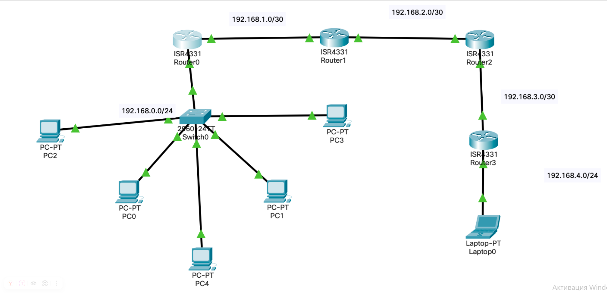

# Лабораторная работа № 9


## Информация о текущей топологии:

### Роутеры и коммутаторы:

| Имя сетевого устройства | IP адреса интерфейсов                      | Маска подсети | Что настроенно |
| ----------------------- | ------------------------------------------ | ------------- | -------------- |
| R0                      | 192.168.0.1 (G0/0/0), 192.168.1.1 (G0/0/1) | /24, /30      | DHCP, RIP      |
| R1                      | 192.168.1.2 (G0/0/0), 192.168.2.1 (G0/0/1) | /30 /30       | RIP            |
| R2                      | 192.168.2.2 (G0/0/0), 192.168.3.1 (G0/0/1) | /30 /30       | RIP            |
| R3                      | 192.168.3.2 (G0/0/0), 192.168.4.1 (G0/0/1) | /30 /24       | RIP            |

### Компьютеры и сервера

| Имя устройства | IP адрес      | Маска подсети | MAC адрес |
| -------------- | ------------- | ------------- | --------- |
| PC0            | 192.168.0.5   | /24           |0002.4a5b.a324|
| PC1            | 192.168.0.4   | /24           |0001.64a0.04aa|
| PC2            | 192.168.0.2   | /24           |0000.0c37.44c0|
| PC3            | 192.168.0.3   | /24           |0002.4a5b.a324|
| PC4            | 192.168.0.6   | /24           |000B.BEE8.C44A|
| Laptop0        | 192.168.4.100 | /24           | ---       |

## Задание:

Заполнить таблицу "Компьютеры и сервера". Через команду traceroute посмотреть доступность до ноутбука и разрешить проблему с доступом.

## Решение
1) Пропинговал каждый компьютер в подсети и собрал mac адресса командой:
```
arp -a
```
2) Настроил на всех роутерах no auto-summary и поставил 2 версию rip:
```
router rip
no auto-summary
version 2
```
3) Настроил на 2 роутере на интерфейсе g0/0/0 ip address 


